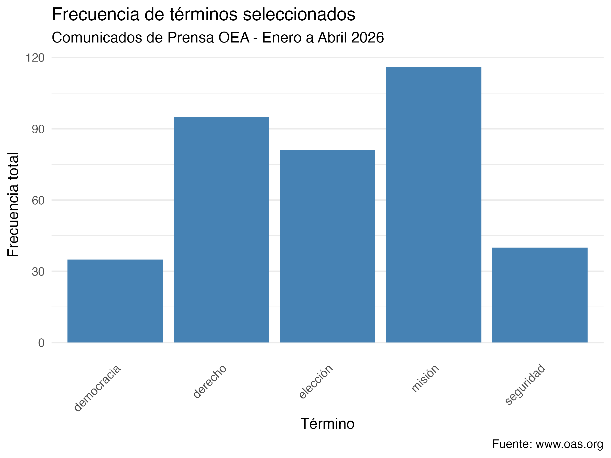

## Introducción

Este informe realiza un analisis de los comunicados de prens de la Organizacion de los Estados Americanos (OEA) publicados entre los meses de enero a abril de 2026. El primer objetivo es identificar los terminos que aparecen con más frecuencia, lo que va a permitir inferir las prioridades temáticas de la organización durante el período seleccionado.

## Organizacion del proyecto

El análisis está organizado en tres scripts modulares ubicados en `TP2/scripts/`:
- `scraping_oea.R`: descarga los comunicados de la web de la OEA para los primeros cuatro meses de 2026.
- `processing.R`: limpia el texto, lematiza y remueve stopwords.
- `metrics_figures.R`: construye la DTM y genera el gráfico de frecuencias.

# Ejecución

```{r}
library(here)
source(here("TP2/scripts/scraping_oea.R"))
source(here("TP2/scripts/processing.R"))
source(here("TP2/scripts/metrics_figures.R"))
```


## Resultados 

{width=80% fig-align="center"}

## Interpretación

